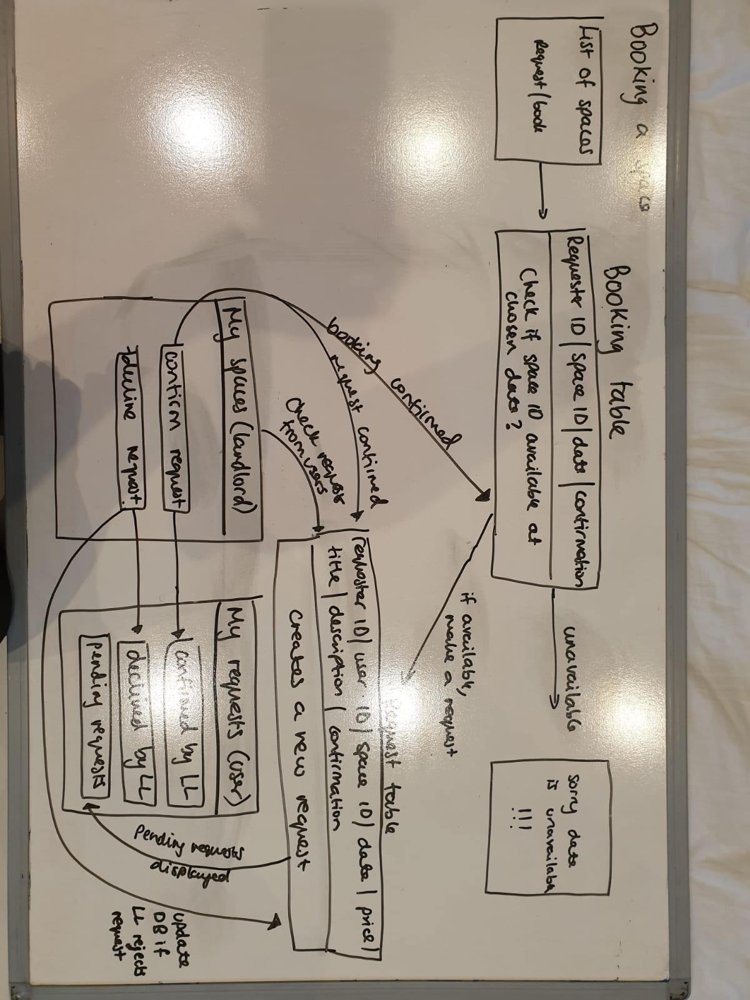
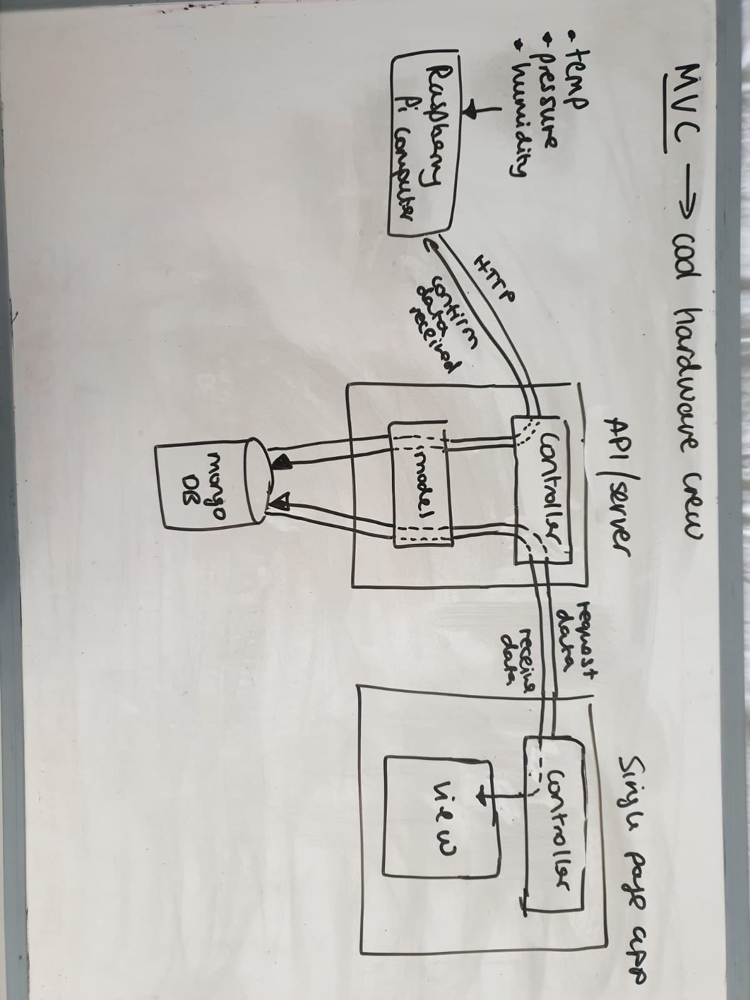

# I can model anything

##### Reflect: What does it mean to be able to model anything?

- To breakdown a complex problem into smaller manageable pieces so that you understand how to implement a solution
- To showcase and plan your ideas in a simple way so that you can communicate your idea to someone. For example, a diagram showing how the Model, View and Controller interact for a specific app

##### Plan: List evidence you aim to collect that would together show you have credibly achieved this goal
- A diagram showing the business logic of the app.
- A diagram showing the MVC architecture.
- A domain modelling/ class diagram / flow diagram example

**Q: Can you model anything? YES **

##### Reflect: How does each of the following examples of your best work show evidence of achieving this goal? (e.g. Diode projects, Github repos)

- [Makersbnb](https://github.com/riyadattani/makersbnb)
  - For the group project, I modelled the business logic:
  
  - This diagram explains the flow when a user requests to book a space listed on the page.

- [Modelling workshop](https://drive.google.com/file/d/1Wbl1UvRPG8Lr9OuQyK0OzyiLAi_4vJEo/view?usp=sharing)
  - This is an example of a sequence diagram when modelling 2 classes and how they interact:

- [Raspberry Pi project](https://github.com/riyadattani/makers-weather-station)

##### What feedback have you had?

_Kim on Makersbnb project_, “When we had the stand up, you explained your thoughts clearly using the whiteboard and were able to sketch out diagrams which helped the team understand the bigger picture of your thought process. I liked the fact that you can model out the domain confidently.”

_Kim on Acebook project_, “Riya was confident at communicating her logic to the rest of the team. She demonstrated a strong ability to diagram features out during our morning scrums. Her ability to latch onto new logic and consider the pros and cons was awesome. In particular, her suggestion of where functionality would sit in the user flow showed her consideration for what the user would experience which was fundamental to keeping the product relevant to the end-user.”
